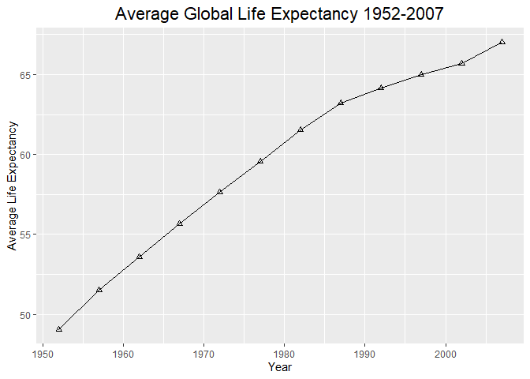
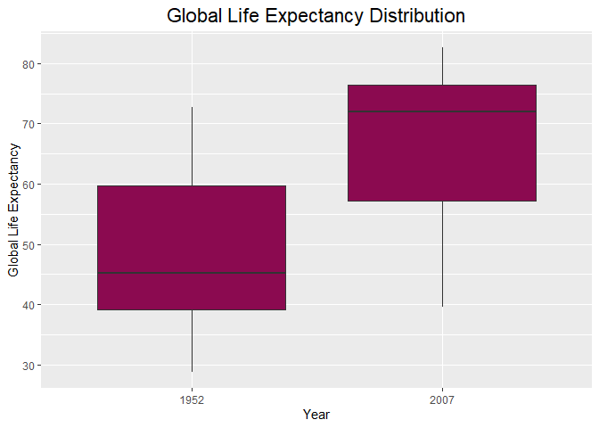
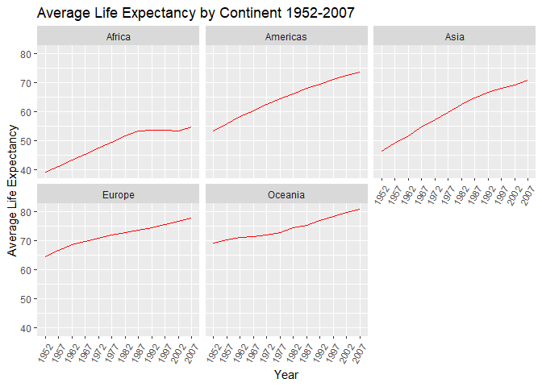
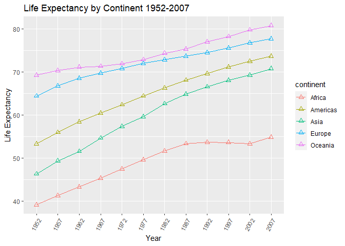
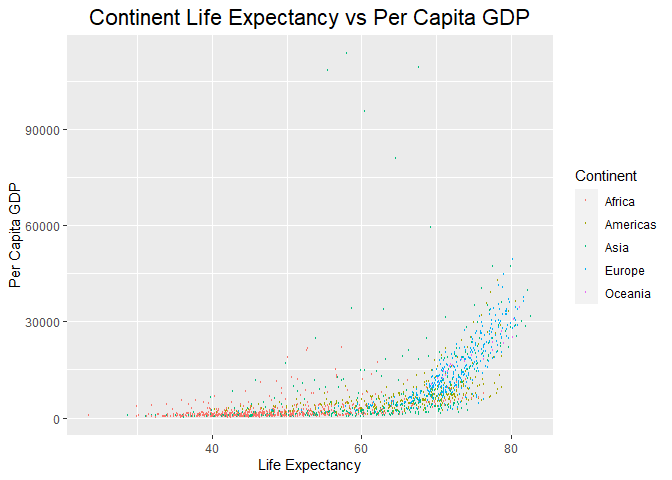
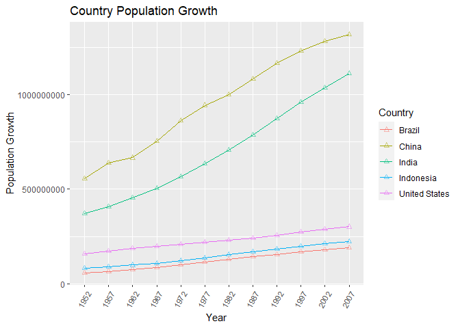
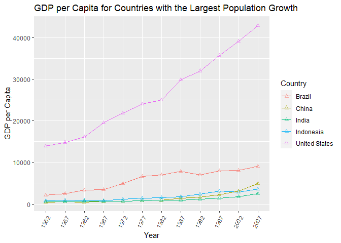
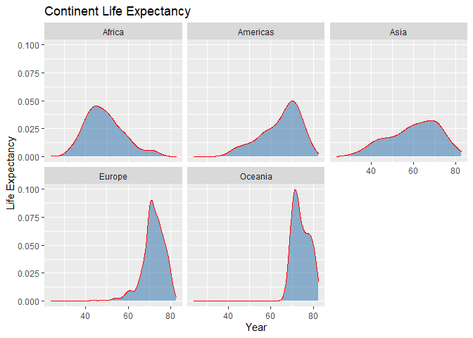

## Instructions
Answer the following questions and complete the exercises in RMarkdown. Please embed all of your code and push your final work to your repository. Your final lab report should be organized, clean, and run free from errors. Remember, you must remove the `#` for the included code chunks to run. Be sure to add your name to the author header above. For any included plots, make sure they are clearly labeled. You are free to use any plot type that you feel best communicates the results of your analysis.  

**In this homework, you should make use of the aesthetics you have learned. It's OK to be flashy!**

Make sure to use the formatting conventions of RMarkdown to make your report neat and clean!  

## Load the libraries

```r
library(tidyverse)
library(janitor)
library(here)
library(naniar)
```

## Resources
The idea for this assignment came from [Rebecca Barter's](http://www.rebeccabarter.com/blog/2017-11-17-ggplot2_tutorial/) ggplot tutorial so if you get stuck this is a good place to have a look.  

## Gapminder
For this assignment, we are going to use the dataset [gapminder](https://cran.r-project.org/web/packages/gapminder/index.html). Gapminder includes information about economics, population, and life expectancy from countries all over the world. You will need to install it before use. This is the same data that we will use for midterm 2 so this is good practice.

```r
#install.packages("gapminder")
library("gapminder")
```

## Questions
The questions below are open-ended and have many possible solutions. Your approach should, where appropriate, include numerical summaries and visuals. Be creative; assume you are building an analysis that you would ultimately present to an audience of stakeholders. Feel free to try out different `geoms` if they more clearly present your results.  

**1. Use the function(s) of your choice to get an idea of the overall structure of the data frame, including its dimensions, column names, variable classes, etc. As part of this, determine how NA's are treated in the data.**  

```r
glimpse(gapminder)
```

```
## Rows: 1,704
## Columns: 6
## $ country   <fct> Afghanistan, Afghanistan, Afghanistan, Afghanistan, Afgha...
## $ continent <fct> Asia, Asia, Asia, Asia, Asia, Asia, Asia, Asia, Asia, Asi...
## $ year      <int> 1952, 1957, 1962, 1967, 1972, 1977, 1982, 1987, 1992, 199...
## $ lifeExp   <dbl> 28.801, 30.332, 31.997, 34.020, 36.088, 38.438, 39.854, 4...
## $ pop       <int> 8425333, 9240934, 10267083, 11537966, 13079460, 14880372,...
## $ gdpPercap <dbl> 779.4453, 820.8530, 853.1007, 836.1971, 739.9811, 786.113...
```


```r
summary(gapminder)
```

```
##         country        continent        year         lifeExp     
##  Afghanistan:  12   Africa  :624   Min.   :1952   Min.   :23.60  
##  Albania    :  12   Americas:300   1st Qu.:1966   1st Qu.:48.20  
##  Algeria    :  12   Asia    :396   Median :1980   Median :60.71  
##  Angola     :  12   Europe  :360   Mean   :1980   Mean   :59.47  
##  Argentina  :  12   Oceania : 24   3rd Qu.:1993   3rd Qu.:70.85  
##  Australia  :  12                  Max.   :2007   Max.   :82.60  
##  (Other)    :1632                                                
##       pop              gdpPercap       
##  Min.   :6.001e+04   Min.   :   241.2  
##  1st Qu.:2.794e+06   1st Qu.:  1202.1  
##  Median :7.024e+06   Median :  3531.8  
##  Mean   :2.960e+07   Mean   :  7215.3  
##  3rd Qu.:1.959e+07   3rd Qu.:  9325.5  
##  Max.   :1.319e+09   Max.   :113523.1  
## 
```


```r
gapminder %>%
  miss_var_summary()
```

```
## # A tibble: 6 x 3
##   variable  n_miss pct_miss
##   <chr>      <int>    <dbl>
## 1 country        0        0
## 2 continent      0        0
## 3 year           0        0
## 4 lifeExp        0        0
## 5 pop            0        0
## 6 gdpPercap      0        0
```


```r
options(scipen=999)
```


```r
gapminder <- clean_names(gapminder)
```


**2. Among the interesting variables in gapminder is life expectancy. How has global life expectancy changed between 1952 and 2007?**

```r
gapminder %>%
  group_by(year) %>%
  summarize(mean_life_exp=mean(life_exp))
```

```
## # A tibble: 12 x 2
##     year mean_life_exp
##  * <int>         <dbl>
##  1  1952          49.1
##  2  1957          51.5
##  3  1962          53.6
##  4  1967          55.7
##  5  1972          57.6
##  6  1977          59.6
##  7  1982          61.5
##  8  1987          63.2
##  9  1992          64.2
## 10  1997          65.0
## 11  2002          65.7
## 12  2007          67.0
```

```r
gapminder %>%
  group_by(year) %>%
  summarize(mean_life_exp=mean(life_exp)) %>%
  ggplot(aes(x=year, y=mean_life_exp)) + 
  geom_line(aes(group=5)) + 
  geom_point(shape=2) +
  labs(title="Average Global Life Expectancy 1952-2007",
       x= "Year",
       y="Average Life Expectancy")+
  theme(plot.title = element_text(size = rel(1.5), hjust = 0.5))
```

<!-- -->

**3. How do the distributions of life expectancy compare for the years 1952 and 2007?**


```r
gapminder$year <- as.factor(gapminder$year)
```


```r
gapminder %>% 
  filter(year== "1952"| year== "2007") %>% 
  group_by(year) %>% 
  ggplot(aes(x=year, y=life_exp, group=year)) + 
  geom_boxplot(fill="deeppink4")+
  labs(title = "Global Life Expectancy Distribution",
       x = "Year",
       y = "Global Life Expectancy") +
  theme(plot.title = element_text(size = rel(1.5), hjust = 0.5))
```

<!-- -->

**4. Your answer above doesn't tell the whole story since life expectancy varies by region. Make a summary that shows the min, mean, and max life expectancy by continent for all years represented in the data.**

```r
gapminder %>% 
  group_by(year, continent) %>% 
  summarize(min_life_exp = min(life_exp),
            max_life_exp = max(life_exp),
            mean_life_exp = mean(life_exp))
```

```
## `summarise()` has grouped output by 'year'. You can override using the `.groups` argument.
```

```
## # A tibble: 60 x 5
## # Groups:   year [12]
##    year  continent min_life_exp max_life_exp mean_life_exp
##    <fct> <fct>            <dbl>        <dbl>         <dbl>
##  1 1952  Africa            30           52.7          39.1
##  2 1952  Americas          37.6         68.8          53.3
##  3 1952  Asia              28.8         65.4          46.3
##  4 1952  Europe            43.6         72.7          64.4
##  5 1952  Oceania           69.1         69.4          69.3
##  6 1957  Africa            31.6         58.1          41.3
##  7 1957  Americas          40.7         70.0          56.0
##  8 1957  Asia              30.3         67.8          49.3
##  9 1957  Europe            48.1         73.5          66.7
## 10 1957  Oceania           70.3         70.3          70.3
## # ... with 50 more rows
```


```r
gapminder %>% 
  group_by(year, continent) %>% 
  summarise(min_life = min(life_exp),
            max_life = max(life_exp),
            mean_life = mean(life_exp)) %>% 
  ggplot(aes(x=year, y=mean_life, group=1)) +
  geom_line(color = "red") +
  facet_wrap(~continent) +
  labs(title = "Average Life Expectancy by Continent 1952-2007",
       x = "Year",
       y = "Average Life Expectancy")+
  theme(axis.text.x = element_text(angle = 60, hjust=1)) 
```

```
## `summarise()` has grouped output by 'year'. You can override using the `.groups` argument.
```

<!-- -->

**5. How has life expectancy changed between 1952-2007 for each continent?**

```r
gapminder %>% 
  group_by(continent, year) %>% 
  summarize(life_expectancy=mean(life_exp))
```

```
## `summarise()` has grouped output by 'continent'. You can override using the `.groups` argument.
```

```
## # A tibble: 60 x 3
## # Groups:   continent [5]
##    continent year  life_expectancy
##    <fct>     <fct>           <dbl>
##  1 Africa    1952             39.1
##  2 Africa    1957             41.3
##  3 Africa    1962             43.3
##  4 Africa    1967             45.3
##  5 Africa    1972             47.5
##  6 Africa    1977             49.6
##  7 Africa    1982             51.6
##  8 Africa    1987             53.3
##  9 Africa    1992             53.6
## 10 Africa    1997             53.6
## # ... with 50 more rows
```

```r
gapminder%>%
  group_by(year,continent)%>%
  summarise(life_expectancy=mean(life_exp))%>%
  ggplot(aes(x=year,y=life_expectancy,group=continent,color=continent))+
  geom_line()+
  geom_point(size=2,shape=2) +
  labs(title = "Life Expectancy by Continent 1952-2007",
       x = "Year",
       y="Life Expectancy") + 
  theme(axis.text.x = element_text(angle = 60, hjust = 1))
```

```
## `summarise()` has grouped output by 'year'. You can override using the `.groups` argument.
```

<!-- -->

**6. We are interested in the relationship between per capita GDP and life expectancy; i.e. does having more money help you live longer?**

```r
gapminder %>% 
  select(gdp_percap, life_exp) %>% 
  arrange(gdp_percap)
```

```
## # A tibble: 1,704 x 2
##    gdp_percap life_exp
##         <dbl>    <dbl>
##  1       241.     45.0
##  2       278.     46.5
##  3       299.     42.1
##  4       300.     32.5
##  5       312.     42.6
##  6       329.     35.9
##  7       331      36.3
##  8       336.     45.0
##  9       339.     39.0
## 10       344.     38.0
## # ... with 1,694 more rows
```

```r
gapminder %>%
  group_by(country) %>% 
  ggplot(aes(x = life_exp, y = gdp_percap, color = continent)) +
  geom_point(size=0.5,shape=1) +
  labs(title = "Continent Life Expectancy vs Per Capita GDP",
       x = "Life Expectancy",
       y = "Per Capita GDP",
       color = "Continent") +
  theme(plot.title = element_text(size = rel(1.5), hjust = 0.5))
```

<!-- -->

**7. Which countries have had the largest population growth since 1952?**

```r
gapminder %>% 
  select(year, pop, country) %>% 
  group_by(country) %>% 
  summarize(pop_growth=diff(pop)) %>% 
  arrange(desc(pop_growth))
```

```
## `summarise()` has grouped output by 'country'. You can override using the `.groups` argument.
```

```
## # A tibble: 1,562 x 2
## # Groups:   country [142]
##    country pop_growth
##    <fct>        <int>
##  1 China    107480000
##  2 China     88780000
##  3 India     87000000
##  4 India     84000000
##  5 China     83754000
##  6 China     81425000
##  7 China     81144473
##  8 China     80935000
##  9 India     80000000
## 10 India     76223784
## # ... with 1,552 more rows
```

**8. Use your results from the question above to plot population growth for the top five countries since 1952.**

```r
gapminder %>% 
  filter(country == "China" | country == "India" | country == "United States" | country == "Indonesia" | country == "Brazil") %>% 
  select(country, year, pop) %>% 
  ggplot(aes(x=year, y=pop, group=country, color=country)) +
  geom_line() +
  geom_point(shape = 2, alpha = 0.5) +
  labs(title = "Country Population Growth",
       x = "Year",
       y = "Population Growth",
       color = "Country")+ 
  theme(axis.text.x = element_text(angle = 60, hjust = 1))
```

<!-- -->

**9. How does per-capita GDP growth compare between these same five countries?**

```r
gapminder %>% 
  filter(country == "China" | country == "India" | country == "United States" | country == "Indonesia" | country == "Brazil") %>% 
  select(country, year, gdp_percap) %>% 
  ggplot(aes(x=year, y=gdp_percap, group=country, color=country)) +
  geom_line() +
  geom_point(shape = 2, alpha = 0.6) +
  labs(title = "GDP per Capita for Countries with the Largest Population Growth",
       x = "Year",
       y = "GDP per Capita",
       color = "Country") +
    theme(axis.text.x = element_text(angle = 60, hjust = 1))
```

<!-- -->


**10. Make one plot of your choice that uses faceting!**

```r
gapminder %>% 
  ggplot(aes(x= life_exp)) +
  geom_density(fill="steelblue", alpha  =0.6, color = "red")+
  facet_wrap(~continent) +
  labs(title = "Continent Life Expectancy",
       x = "Year",
       y = "Life Expectancy",
       color = "Continent")
```

<!-- -->

```r
  theme(plot.title = element_text(size = rel(1.5), hjust = 0.5))
```

```
## List of 1
##  $ plot.title:List of 11
##   ..$ family       : NULL
##   ..$ face         : NULL
##   ..$ colour       : NULL
##   ..$ size         : 'rel' num 1.5
##   ..$ hjust        : num 0.5
##   ..$ vjust        : NULL
##   ..$ angle        : NULL
##   ..$ lineheight   : NULL
##   ..$ margin       : NULL
##   ..$ debug        : NULL
##   ..$ inherit.blank: logi FALSE
##   ..- attr(*, "class")= chr [1:2] "element_text" "element"
##  - attr(*, "class")= chr [1:2] "theme" "gg"
##  - attr(*, "complete")= logi FALSE
##  - attr(*, "validate")= logi TRUE
```

## Push your final code to GitHub!
Please be sure that you check the `keep md` file in the knit preferences. 
